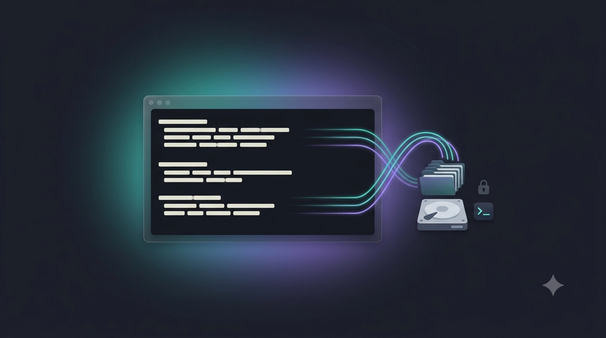

<p align="center">
  
</p>

# cchat — a local ChatGPT / Claude-desktop replacement

[](https://github.com/Dzhuneyt/cchat/actions/workflows/shellcheck.yml)
[](LICENSE)


> Your terminal as a private, searchable ChatGPT — every conversation saved as a local, greppable folder.

A lightweight bash harness around [Claude Code](https://docs.claude.com/en/docs/claude-code).
Run `cchat` and you get a terminal Q&A session that behaves like the Claude desktop app or
ChatGPT — but every conversation is saved as a **self-contained, locally-searchable folder**
on your machine. No web UI, no export buttons, no paid search.

## Demo

A reproducible walkthrough (install → self-contained folder → markdown transcript → `search`
recall) is scripted in [`docs/demo.tape`](docs/demo.tape); a live-session clip is recorded
separately. See [`docs/DEMO.md`](docs/DEMO.md) to generate both.

<!-- After running `vhs docs/demo.tape`, embed the surface clip here:

and embed your recorded live session below it:
 -->
<!-- LIVE-SESSION PLACEHOLDER: drop docs/live.gif (recorded per docs/DEMO.md) and embed it here. -->

## What you get

Each session lives in its own folder under `~/chats/`:

```
~/chats/2026-06-18-1430-tax-deadline-questions/
├── transcript.jsonl   # raw Claude Code session log — lossless source of truth
├── transcript.md      # clean, greppable conversation (user/assistant text turns)
├── meta.json          # topic, slug, creation timestamp, source log path
└── <any files the assistant created during the chat>
```

Because the session runs *inside* this folder, anything the assistant writes lands here too.

## Dependencies

| Tool | Needed for | Install |
|------|-----------|---------|
| `claude` | launching sessions | <https://docs.claude.com/en/docs/claude-code> |
| `jq`     | rendering `transcript.md` + `meta.json` | `brew install jq` |
| `rg` (ripgrep) | `cchat search` | `brew install ripgrep` |

`jq` and `rg` are only required for rendering and search respectively; the raw
`transcript.jsonl` is always preserved even if `jq` is missing.

## Install

```bash
git clone git@github.com:Dzhuneyt/cchat.git
cd cchat
chmod +x cchat
ln -s "$PWD/cchat" /usr/local/bin/cchat   # or any directory already on your PATH
```

## Usage

```bash
cchat                   # prompts: "Topic for this chat:" then opens the session
cchat "tax deadline"    # skip the prompt — topic preset from the argument
cchat search "deadline" # ripgrep across every transcript, grouped by session
```

End the session the way you normally exit Claude Code; the transcript is archived
automatically on exit, and the saved folder path is printed.

### Configuration

| Variable | Default | Purpose |
|----------|---------|---------|
| `CHAT_HOME` | `~/chats` | Where session folders are created |
| `CLAUDE_PROJECTS_DIR` | `~/.claude/projects` | Where Claude Code stores its session logs |

## How recall works

`cchat search <query>` runs `ripgrep` over every `transcript.md` under `CHAT_HOME`,
printing matching lines with two lines of context, grouped under each session's path.
That's enough to recall a fact from a past chat and then open the full transcript or folder.

## Storage layout & the path to SQLite full-text search

Search is ripgrep today, but the on-disk format is deliberately **index-ready** so a
SQLite FTS5 index can be layered on later **without reformatting any existing transcripts**.
A future indexer can simply walk `CHAT_HOME` and, for each session folder:

- **Discover** the session by its folder (and read attributes from `meta.json` — keys:
  `topic`, `slug`, `created` (ISO-8601), `source_jsonl`).
- **Ingest** `transcript.md` turn-by-turn using its stable delimiter: every turn begins
  with a line of the form

  ```
  ## [<role>] <ISO-8601-timestamp>
  ```

  where `<role>` is `user` or `assistant`. Splitting on this heading yields one indexable
  record per turn, with role and timestamp already parsed — no need to touch the JSONL.

Because that delimiter and the `meta.json` schema are fixed, adding the index is purely
additive: already-archived sessions remain valid input unchanged.

## Notes

- Transcripts are archived **at session end**, not streamed live. A future improvement
  (tracked in the design doc) is to land the transcript in the folder in real time.
- `transcript.md` intentionally omits tool calls and the model's internal "thinking" to stay
  conversational and greppable. The raw `transcript.jsonl` keeps everything if you need it.
- **Privacy:** transcripts are stored **in plaintext** under `~/chats/`. Don't paste anything
  you wouldn't write to a local file, and keep `~/chats/` out of any git repository.
- **Portability:** developed and tested on macOS; runs on Linux too (needs `bash`, `jq`, and `ripgrep`).
- **Why `cchat` and not `chat`?** macOS and Linux already ship a `chat` binary (the PPP
  `chat(8)` utility) that usually wins on `PATH`, so this tool uses the unambiguous name.

## Development

`cchat` is a single self-contained bash script — no build step. After cloning:

```bash
chmod +x cchat
./cchat --help
```

The script is written to be **source-able** without running `main` (it guards on
`BASH_SOURCE`), so helper functions can be exercised in isolation:

```bash
source ./cchat
slugify "Tax deadline questions"   # -> tax-deadline-questions
```

Linting matches CI — run [ShellCheck](https://www.shellcheck.net/) before opening a PR:

```bash
shellcheck cchat
```

See [CONTRIBUTING.md](CONTRIBUTING.md) for the full contributor guide.

## Security

Found a vulnerability? Please report it privately — see [SECURITY.md](SECURITY.md). Do not
open a public issue for security problems. Also note the plaintext-transcript privacy caveat
under [Notes](#notes).

## License

[MIT](LICENSE) © Dzhuneyt
